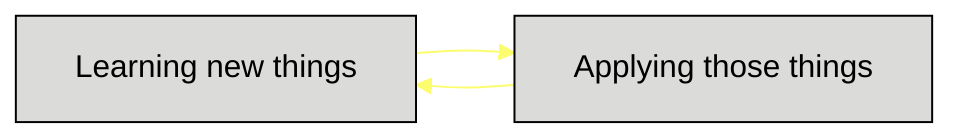

    

<h1 align="center">I am Sanjana</h1> 
<h2 align="center">About Me</h3>

    I'm a Computer Science graduate, currently pursuing my Master's degree in Scientific 
Computing from Savitribai Phule Pune University.

<!---
astroartics/astroartics is a ✨ special ✨ repository because its `README.md` (this file) appears on your GitHub profile.
You can click the Preview link to take a look at your changes.
--->
