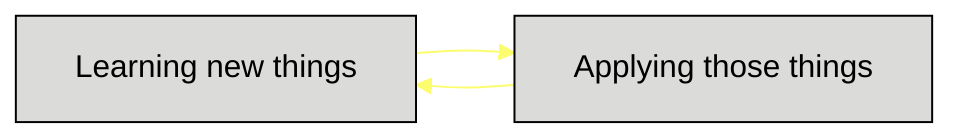

    

<h2 align="center">Hi there 👋 I am Sanjana - a Computer Science graduate.</h2>   

  
<h2 align="center">About Me</h2>

    I'm currently pursuing my Master's degree in Scientific  Computing from Savitribai Phule Pune University.

<h2 align="center">Things I like</h2>

    💻 Programming     
    📷 Macro Photography 
    🧩 Problem Solving       
    🖌️ Canvas Painting        

  

<h2 align="center">Languages</h2>

    
Programming

    
     
Front-end

    
    
      
Back-end

    
<!--      -->

<!---->
<!---->

<!---
astroartics/astroartics is a ✨ special ✨ repository because its `README.md` (this file) appears on your GitHub profile.
You can click the Preview link to take a look at your changes.
--->
